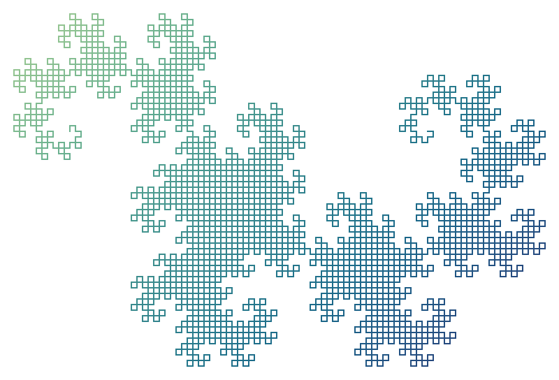
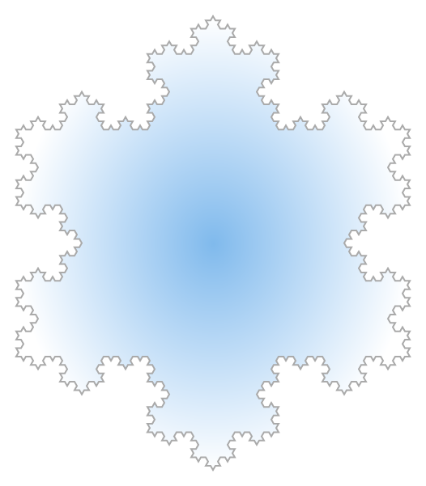
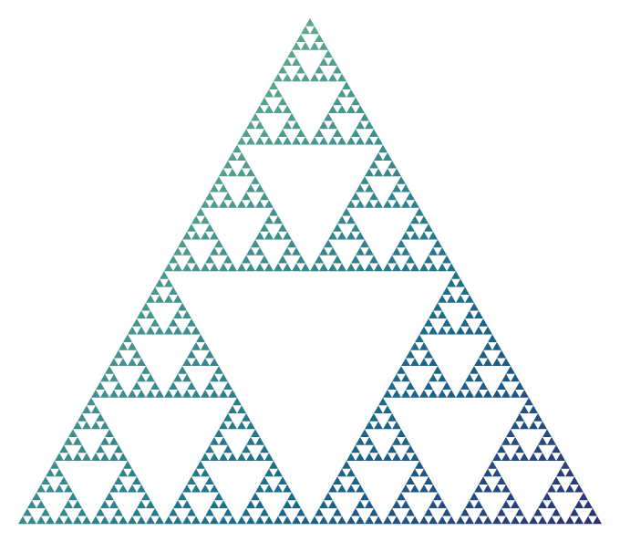
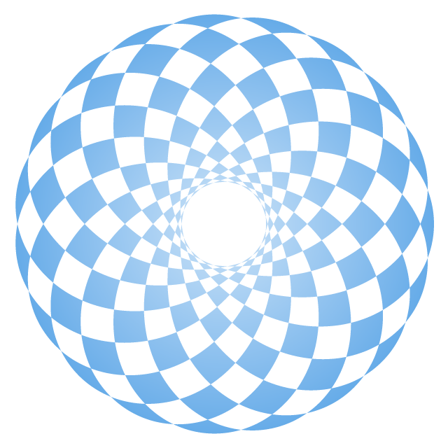

# Fractusist

Create a variety of wonderful fractals and curves in Typst.


## Examples

<table>
<tr>
  <td>
    <a href="examples/dragon-curve-n12.typ">
      
    </a>
  </td>
  <td>
    <a href="examples/koch-snowflake-n4.typ">
      
    </a>
  </td>
</tr>
<tr>
  <td>Dragon Curve</td>
  <td>Koch Snowflake</td>
</tr>
<tr>
  <td>
    <a href="examples/sierpinski-triangle-n6.typ">
      
    </a>
  </td>
  <td>
    <a href="examples/hypotrochoid-a19-b16-h2.typ">
      
    </a>
  </td>
</tr>
<tr>
  <td>Sierpiński Triangle</td>
  <td>Hypotrochoid</td>
</tr>
</table>

*Click on the example image to jump to the code.*


## Features

- Generate fractals using [L-system](https://en.wikipedia.org/wiki/L-system).
- The number of iterations, step size, fill and stroke styles, etc. of generated fractals could be customized.
- Generate spirograph curves with different parameters.
- Generate Lissajous curves with different parameters.


## Usage

Import the latest version of this package with:

```typ
#import "@preview/fractusist:0.2.0": *
```

Each function generates a specific fractal or spirograph curve. The input and output arguments of all functions have a similar style. The content returned is the `box` element.

For more codes with these functions see [tests](https://github.com/liuguangxi/fractusist/tree/main/tests).


## Reference

### Dragon

- `dragon-curve`: Generate dragon curve (n: range **[0, 16]**).

```typ
#let dragon-curve(n, step-size: 10, stroke: black + 1pt) = {...}
```


### Hilbert

- `hilbert-curve`: Generate 2D Hilbert curve. (n: range **[1, 8]**).

```typ
#let hilbert-curve(n, step-size: 10, stroke: black + 1pt) = {...}
```

- `peano-curve`: Generate 2D Peano curve (n: range **[1, 5]**).

```typ
#let peano-curve(n, step-size: 10, stroke: black + 1pt) = {...}
```


### Koch

- `koch-curve`: Generate Koch curve (n: range **[0, 6]**).

```typ
#let koch-curve(n, step-size: 10, fill: none, stroke: black + 1pt) = {...}
```

-  `koch-snowflake`: Generate Koch snowflake (n: range **[0, 6]**).

```typ
#let koch-snowflake(n, step-size: 10, fill: none, stroke: black + 1pt) = {...}
```


### Sierpiński

- `sierpinski-curve`: Generate classic Sierpiński curve (n: range **[0, 7]**).

```typ
#let sierpinski-curve(n, step-size: 10, fill: none, stroke: black + 1pt) = {...}
```

- `sierpinski-square-curve`: Generate Sierpiński square curve (n: range **[0, 7]**).

```typ
#let sierpinski-square-curve(n, step-size: 10, fill: none, stroke: black + 1pt) = {...}
```

- `sierpinski-arrowhead-curve`: Generate Sierpiński arrowhead curve (n: range **[0, 8]**).

```typ
#let sierpinski-arrowhead-curve(n, step-size: 10, stroke: black + 1pt) = {...}
```

- `sierpinski-triangle`: Generate 2D Sierpiński triangle (n: range **[0, 6]**).

```typ
#let sierpinski-triangle(n, step-size: 10, fill: none, stroke: black + 1pt) = {...}
```


### Spirograph

- `hypotrochoid`: Generate hypotrochoid (a, b, h: range **[1, 100]**).

```typ
#let hypotrochoid(a, b, h, size: 100, fill: none, fill-rule: "non-zero", stroke: black + 1pt) = {...}
```

- `epitrochoid`: Generate epitrochoid (a, b, h: range **[1, 100]**).

```typ
#let epitrochoid(a, b, h, size: 100, fill: none, fill-rule: "non-zero", stroke: black + 1pt) = {...}
```


### Lissajous

- `lissajous-curve`: Generate Lissajous curve (a, b: range **[1, 100]**, d: range **[0, 2]**).

```typ
#let lissajous-curve(a, b, d, x-size: 100, y-size: 100, fill: none, fill-rule: "non-zero", stroke: black + 1pt) = {...}
```
